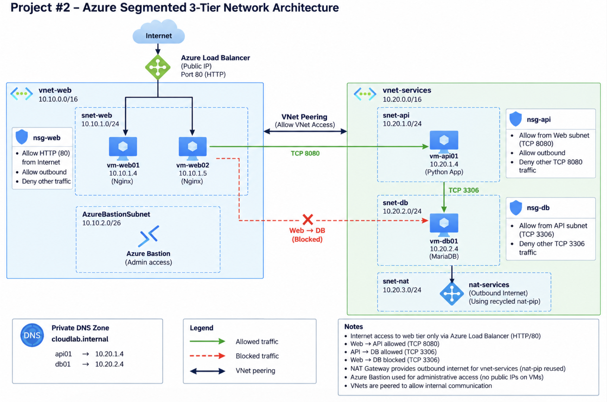

# Azure Segmented Network Infrastructure

This project is a multi-tier Azure network environment that I built to practice network segmentation, private communication, load balancing, DNS, and troubleshooting.

The main goal was to separate the web, application, and database tiers instead of placing everything in one virtual network.

## Architecture



I used two Azure virtual networks:

### vnet-web
- Address space: 10.10.0.0/16
- snet-web: 10.10.1.0/24
- AzureBastionSubnet: 10.10.2.0/26

### vnet-services
- Address space: 10.20.0.0/16
- snet-api: 10.20.1.0/24
- snet-db: 10.20.2.0/24

The two VNets are connected using VNet peering.

## Virtual Machines

| VM | Purpose | Private IP |
|---|---|---|
| vm-web01 | Nginx web server | 10.10.1.4 |
| vm-web02 | Nginx web server | 10.10.1.5 |
| vm-api01 | Internal application service | 10.20.1.4 |
| vm-db01 | MariaDB server | 10.20.2.4 |

I did not assign public IP addresses directly to the VMs. I used Azure Bastion for administration.

## Traffic Flow

The network was configured so that:

- Internet traffic can reach the web servers through Azure Load Balancer on port 80
- Web servers can reach the API server on port 8080
- The API server can reach the database on port 3306
- Web servers cannot connect directly to the database
- The database is not directly accessible from the Internet

## Network Security Groups

I used separate NSGs for each tier.

`nsg-web` allows HTTP traffic to the web subnet.

`nsg-api` allows traffic from the web subnet to the API on TCP 8080 and blocks other traffic to that port.

`nsg-db` allows TCP 3306 only from the API subnet and blocks other database traffic.

This allowed me to control which tier could communicate with the next one.

## Load Balancer

I configured a Standard Azure Load Balancer in front of `vm-web01` and `vm-web02`.

The load balancer uses:

- Public frontend IP
- Backend pool containing both web servers
- TCP 80 health probe
- Port 80 load-balancing rule

Both web servers run Nginx, and I gave each one a different test page so I could confirm which backend server was responding.

## Private DNS

I created the private DNS zone:

`cloudlab.internal`

Records used in the project:

- `api01.cloudlab.internal` → 10.20.1.4
- `db01.cloudlab.internal` → 10.20.2.4

I linked the DNS zone to both VNets.

This allowed the servers to communicate using DNS names instead of only private IP addresses.

## Database

MariaDB was installed on `vm-db01`.

I changed the MariaDB configuration so that it listened on the VM's private IP:

`10.20.2.4:3306`

From the API server I tested the connection with:

```bash
nc -zv -w 5 db01.cloudlab.internal 3306
```

The connection succeeded.

I also tested port 3306 from the web tier, and that connection was blocked as expected.

## NAT Gateway

While setting up the database VM, I ran into an outbound Internet connectivity issue because the VM only had a private IP.

I used a NAT Gateway on the database subnet so the VM could reach Ubuntu package repositories without giving the VM its own public IP.

After that, package updates and the MariaDB installation worked normally.

## Testing

Some of the checks I used during the project:

```bash
curl http://10.20.1.4:8080
```

Web server to API by private IP.

```bash
curl http://api01.cloudlab.internal:8080
```

Web server to API using Private DNS.

```bash
nc -zv -w 5 db01.cloudlab.internal 3306
```

API server to MariaDB.

I also tested Web → Database traffic to make sure it was denied.

## Troubleshooting

I intentionally created a few network problems so I could practice troubleshooting instead of only building the environment.

### NSG priority issue

I changed the API deny rule so that it had a higher priority than the allow rule.

Web → API traffic stopped working.

I used Network Watcher IP Flow Verify and found that the deny rule was blocking the connection. After fixing the rule priority, connectivity worked again.

### Route table issue

I created a route for the services network with the next hop set to `None`.

This caused traffic from the web subnet to the services network to fail.

Network Watcher Next Hop showed that the traffic was being sent to `None`.

After removing the bad route, communication was restored.

### VNet peering issue

I temporarily disabled virtual network access on the peering connection.

Communication between the two VNets stopped.

After restoring VNet access, Web → API connectivity worked again.

I also used Network Watcher Connection Troubleshoot for final validation.

More screenshots and troubleshooting details are in:

[troubleshooting.md](troubleshooting.md)

## Azure Services Used

- Virtual Networks and Subnets
- Virtual Machines
- Network Security Groups
- VNet Peering
- Azure Load Balancer
- Azure Bastion
- Azure Private DNS
- NAT Gateway
- Route Tables
- Azure Network Watcher

## What I Learned

This project helped me understand how Azure networking components work together instead of looking at each service separately.

The most useful part for me was troubleshooting broken connectivity and figuring out whether the problem was caused by an NSG rule, route, peering configuration, DNS, or the service running on the VM.
